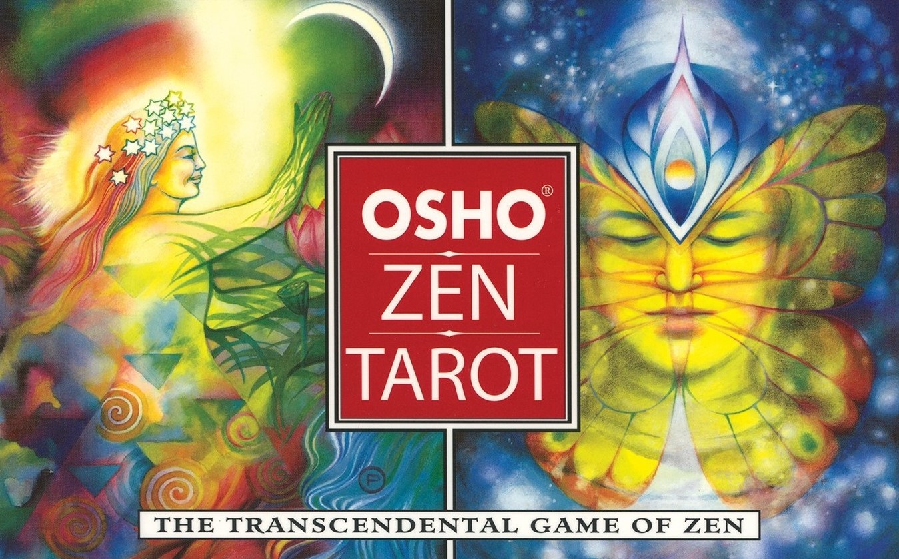

<h1 align="center"> Osho Zen Tarot </h1>

I have created a Tarot game website based on the Osho Zen Tarot book and cards. The site is responsive on all devices, easy to use, play 
and find relevant information. The page is for people who would like to play the Osho Zen Tarot, and who are curious about the Tarot 
made by Osho, because this Tarot is different from all other Tarot games and Osho was himself an interesting and inspirational person 
for many people all over the world and still is until this day. 
This is my second milestone project that I have created for Code Institute with my newly acquired skills. 
<a href="https://danikrs.github.io/interactive-frontend/" target="_blank">View website in GitHub Pages</a>

<h1 align="center">
  
</h1>

## UX (User Experience)

### User stories

1.	As a First time Visitor, I want to quickly figure out how to play the game and know more about the Tarot card spread.
2.	As a First time Visitor, I would like to see that I can choose from 79 back cards that is the full card deck and 
be able to view the front cards and their descriptions as well. 
3.	As a First time Visitor I would like to see that there are some other card spreads I can choose, but not too many.  
4.	As a First time Visitor, I want the position of the cards already laid out with their respective meanings under 
them, so that I can start playing right away without having to look up the meanings somewhere else or know how to lay 
out the spreads and where to put the cards.
5.	As a First time Visitor, once selected all cards I want to be able to view the description of the front cards 
by clicking one card at the time, while still having the reading up so that I can easily change to view the other cards 
descriptions whenever I want.
6.	As a First time Visitor, I want to be able to view the front cards in a bigger size and read their descriptions
 which are clear and easy to read.
7. As a Returning Visitor, I want to be able to change the Tarot card spread and see what other spreads 
there are and easily locate and play them.
8. As a Returning Visitor, I want to see where I can contact the creator of the Tarot to request for more card spreads or other
 questions I might have. 

### Design
The design was inspired by the Osho Zen Tarot cover book, its cards, and the background image on the Tarot play. The page 
is designed to be visually appealing, simple, with not too many options so that the user does not feel lost and overburden,
and at the same time feel like nothing is missing. The colour, fonts and images are picked to enhance the aesthetics of 
the page so that the user feels good and gets into a proper state of mind for playing the Tarot. 

#### Color Scheme
The website is colourful with a variety of colours since the Osho Tarot cards are quite colourful and bright. 
Despite the colour variety, consistency is kept throughout the page with colour matching and fitting colour combinations.  
- The orange numbers in the card containers, the reddish text-shadow and the greyish and red colours on the scrollbars 
are picked for matching the back cards. 
- The blue, purple and pink background colour gradient on the mobile game page was picked to match the colours of the hero image.  
- The colours on the buttons are bright with different colours, nicely contrasting against their background to make them more visible.  

#### Typography
The Roboto font is picked for the main text of the page because its elegant and easy to read. Oswald is used for the 
headings in the contact form for helping it look more stylish. Archivo is used for making the logo stand out with 
its boldness, and Bungee for the “Start Playing” button for its game-ish inviting look.

#### Images 
- The hero image on the Start page is the same image that is on the cover on the Osho Zen Tarot book. This cover 
is chosen for its artistic eye-catching look and so that the user can get the feel of having the Osho Tarot book in 
front of them and click to look what’s inside of it.  
- The hero image on the Game page is to make you feel the infinity of the spiritual cosmos and connect you with your 
own energy. At the same time is gives you a sense of being calm and protected by the universe. The background image makes 
it more fun to play the game than just having a background colour only.  

#### Text   
The text is divided into parts and background colour and text-shadow is added to make the text 
stand out against the background image, to make the reading easier. Only the most essential text is displayed to 
*not overload the reader with too much text*. Some heading and links are decorated with icons to enhance the UX experience and the aesthetics.   

### Wireframes 
- **Start** - <a href="https://drive.google.com/file/d/1k0I2ZeovWSQJJXrD4Jkze871-ASz7XSz/view?usp=sharing" target="_blank">View</a>
- **Game** - <a href="https://drive.google.com/file/d/1VH7dzRLSU-08ZlM-yWVqkkP94aD2612p/view?usp=sharing" target="_blank">View</a>
- **Description** - <a href="https://drive.google.com/file/d/10wW3pjLs_ZgLmq6108cjdqXhhQNwXvr2/view?usp=sharing" target="_blank">View</a>
- **Start mobile** - <a href="https://drive.google.com/file/d/13Ln69NBA_P7FEFuMZJX5bLSUBzHvy-df/view?usp=sharing" target="_blank">View</a>
- **Game mobile** - <a href="https://drive.google.com/file/d/1BbypV1P8wJCFLCeFBD53DSB-ie-5D_5b/view?usp=sharing" target="_blank">View</a>
- **Description mobile** - <a href="https://drive.google.com/file/d/1xQMbyVIl4wlu9jf-PsnI-nH0LMGGOSnf/view?usp=sharing" target="_blank">View</a>
  

## Features
Responsive on all device sizes.

### Existing Features
- **Start Playing Button**. Clicking the button leads the user to the Game page.
- **Header Logo**. Clicking the logo returns the user to Start.
- **Card Spread Button**. Clicking the button pops up links that takes the user to other spreads and options.
- **The Diamond link**. Takes the user to play the Diamond spread. 
- **The Key link**. Takes the user to play the Key spread. 
- **The Mirror link**. Takes the user to play the Mirror spread. 
- **The Celtic Cross link**. Takes the user to play the Celtic Cross spread. 
- **The All Cards link**. Takes the user to view all front cards. 
- **Back To Reading Button**. Clicking on the BTR button takes the user back to only see the reading. 
- **About Spread Section**. Gives users information about the card spread that is currently being played.
- **Description Section**. The front cards have a onclick attached that takes the user to view the description of the cards. 
- **Scrollbar**. Allows the back cards and the description text to get scrolled to view more. 
- **Back cards**. Clicking on the back cards displays front cards in the containers with numbers.
- **Card meanings**. Clicking on the card meanings on smaller devices makes the meanings bigger.  
- **Footer Copyright**. To protect copyright.
- **Footer Contact Button**. Clicking the button pops up a contact form modal.

### Features Left to Implement
-  More card spreads and commentary text for the descriptions.
- Option to choose Spanish language of the website.

## Technologies Used

Languages Used for this project: **HTML**, **CSS** & **Javascript**. 
1.	[Bootstrap4](https://getbootstrap.com/): – for making the website responsive on all devices and for the styling. 

2.	[Animate.css](https://animate.style/): – for animating the "Start Playing" button. 

3.	[Google Fonts](https://fonts.google.com/): – were used as fonts on the website. 

4.	[Font Awesome](https://fontawesome.com/): – icons were used for aesthetics and enhancing the UX.

5.	[Git](https://git-scm.com/): – was used for pushing the project’s code to GitHub through version control and Git committing. 

6.	[GitHub](https://github.com/): – is used to store the project’s code.

7.	[Draw.io](https://app.diagrams.net/): – was used to create and design the wireframes. Draw.io was also used to edit the hero-image on the mobile Start page.

8.	[jQuery](https://jquery.com/): – was used as a library for Javascript.

9.	[Hover.css](http://ianlunn.github.io/Hover/): – was used for hover effect on back/front cards & card meanings.

